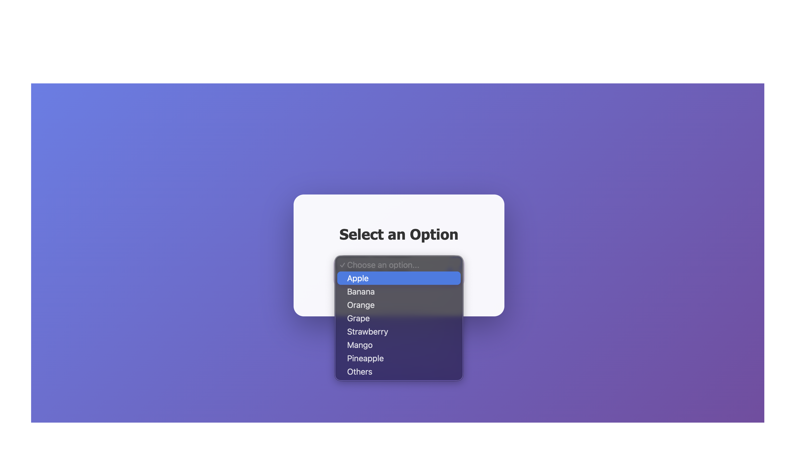
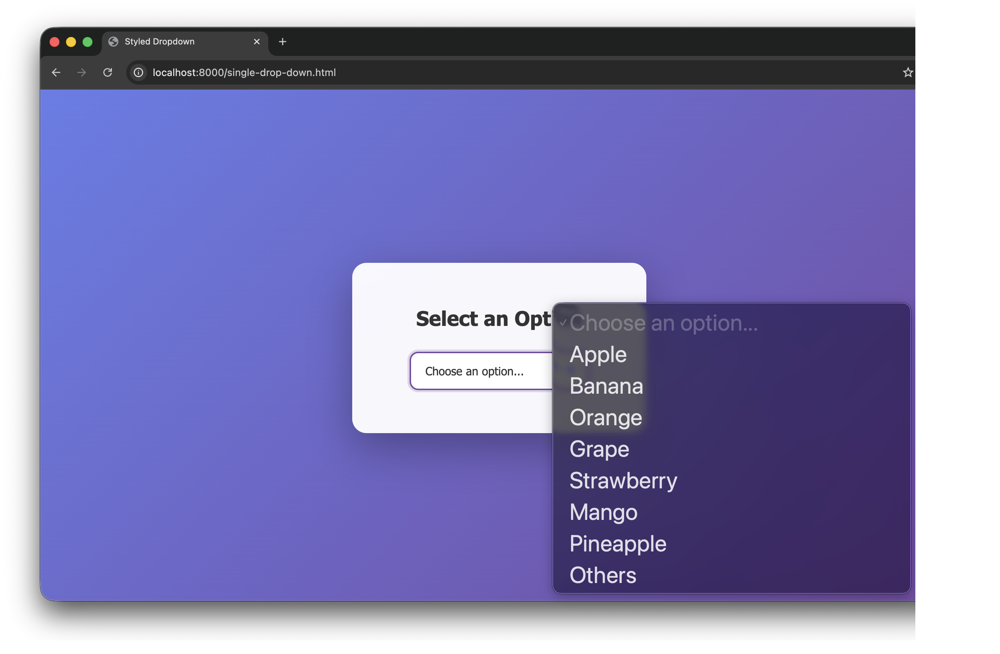
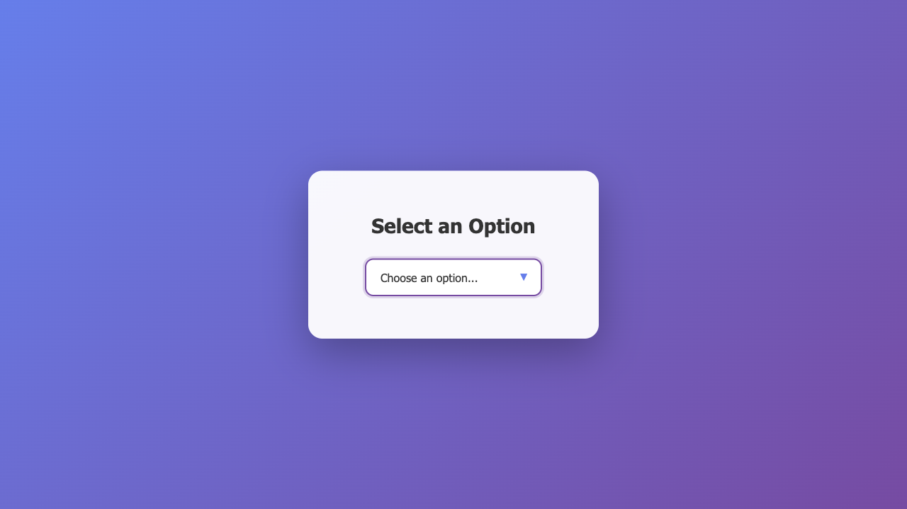

# playwright-screenshot-issue

We use Playwright for our browser automation agent, but we frequently encounter an issue where the screenshots captured by Playwright differ from what is actually rendered in Chromium. This discrepancy is especially noticeable when working with dropdown menus. Please see the screenshots below for examples.

There are two issues here:

1. When the page is opened via Playwright, the dropdown does not render correctly.
2. When Playwright takes a screenshot, the dropdown items are not captured.


**The correct rendering of the page**



**What we see on the screen when playwright opens the page in Chromium**



**What playwright captures**



## Steps to reproduce

## Prerequisites

- [Node.js](https://nodejs.org/) 18 or newer
- [npm](https://docs.npmjs.com/downloading-and-installing-node-js-and-npm)

## Setup

Install the dependencies and Playwright browsers:

```bash
npm install
npx playwright install
```

## Capture the dropdown screenshot

1. Serve the static `single-drop-down.html` file:

   ```bash
   python -m http.server 8000
   ```
   Keep this server running while you execute the script.
2. In a new terminal, run the Playwright script:

   ```bash
   node scripts/capture-dropdown.js
   ```
   The script prints the installed Playwright version and the absolute path to the generated screenshot (saved in the `screenshots` directory).
