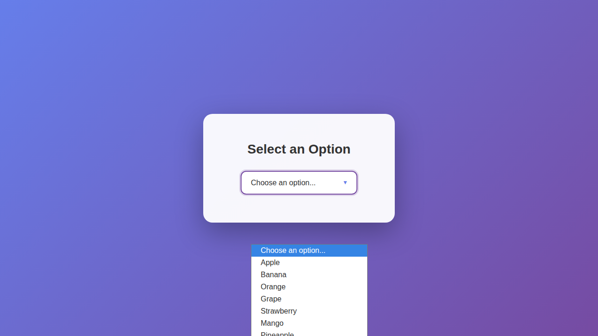
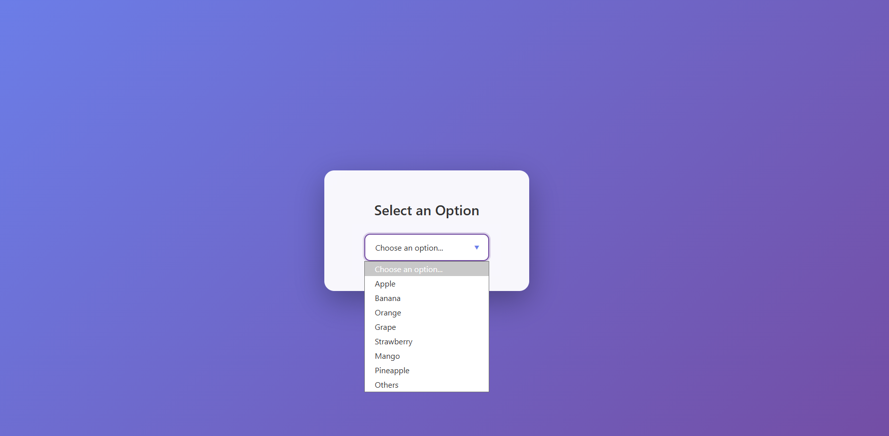

# Playwright Screenshot Issues with \<select\> Elements

> Playwright version: 1.56.1 (latest)

We use Playwright for our browser automation agent, but we frequently encounter an issue where screenshots captured from `<select>` elements differ from what is actually rendered in Chromium.

This bug report focuses on *macOS*, though similar behavior occurs on *Ubuntu*. On Windows, the `page.screenshot()` command freezes, preventing us from fully reproducing the issue there.

The discrepancy is most noticeable with dropdown menus. Please refer to the screenshots below for examples.

## Observations

### On macOS:

* When the page is opened via Playwright, dropdown menus do not render correctly.
* When taking a screenshot, the dropdown items are missing from the captured image.

### On Ubuntu:

* When taking a screenshot, the dropdown items do not render correctly

### On Windows 11:

The dropdown renders correctly in Chromium when opened via Playwright, but page.screenshot() halts, and the rendering appears corrupted after the freeze (see attached screenshot).

####  Affected Platforms

This issue occurs on macOS, Windows, and Ubuntu Linux (other Linux distributions have not been tested).

# Issue on Mac OS 

**The correct rendering of the page**


**What we see on the screen when playwright opens the page in Chromium**


**What playwright captures**


# Issue on Ubuntu 

On Ubuntu the same separation happens during the screenshot 



# Issue on Windows 11
We could not properly evaluate this on Windows since on our windows 11 the following line 

```javascript
  await page.screenshot({ path: 'screenshot.png', fullPage: true });
```


halts and freezes the rendering on our Chromium


we get a timeout 

```bash
❯ node scripts/capture-dropdown.js
Failed to capture dropdown screenshot: page.screenshot: Timeout 30000ms exceeded.
Call log:
  - taking page screenshot
  - waiting for fonts to load...
  - fonts loaded

    at C:\...\scripts\capture-dropdown.js:21:14 {
  name: 'TimeoutError'
}

```
Please note that the page looks file in Chrome and Chromium before that line 




## Steps to reproduce

## Prerequisites

- [Node.js](https://nodejs.org/) 18 or newer
- [npm](https://docs.npmjs.com/downloading-and-installing-node-js-and-npm)

## Setup

Install the dependencies and Playwright browsers:

```bash
npm install
npx playwright install
```

## Capture the dropdown screenshot

1. Serve the static `single-drop-down.html` file:

   ```bash
   python -m http.server 8000
   ```
   Keep this server running while you execute the script.
2. In a new terminal, run the Playwright script:

   ```bash
   node scripts/capture-dropdown.js
   ```
   The script prints the installed Playwright version and the absolute path to the generated screenshot (saved in the `screenshots` directory).
